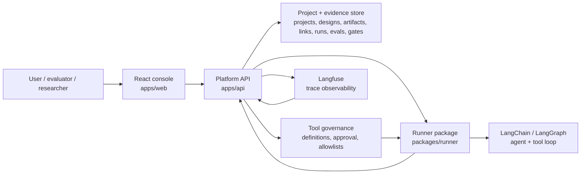
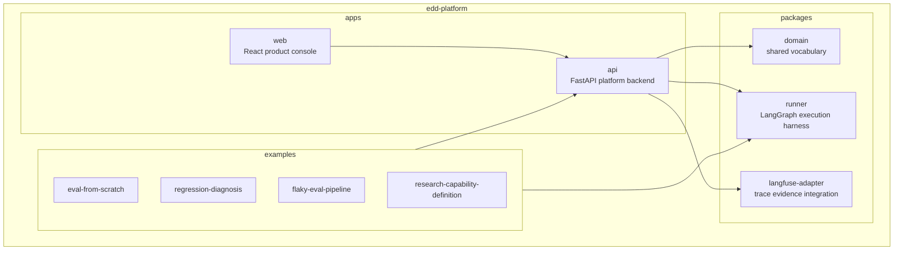
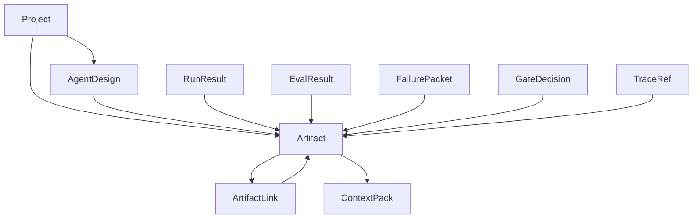
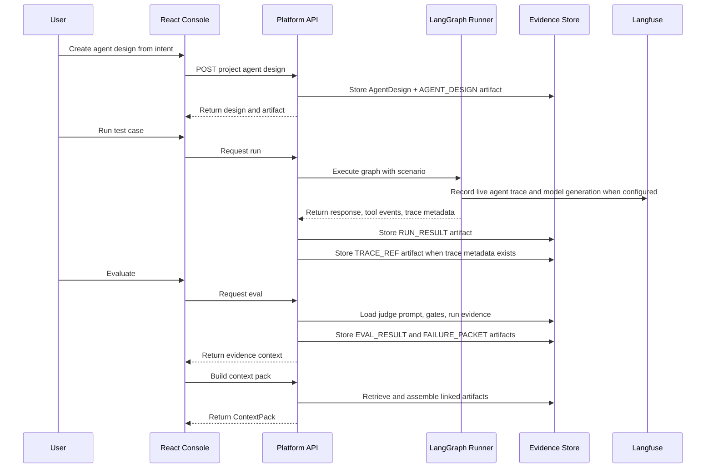
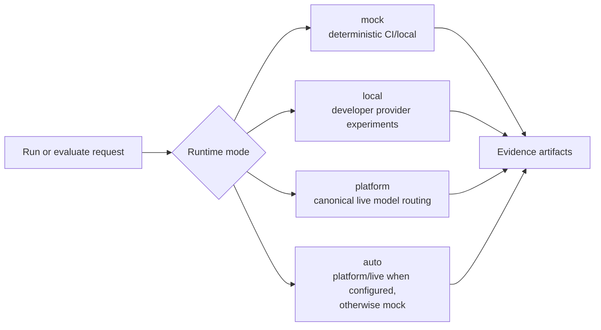
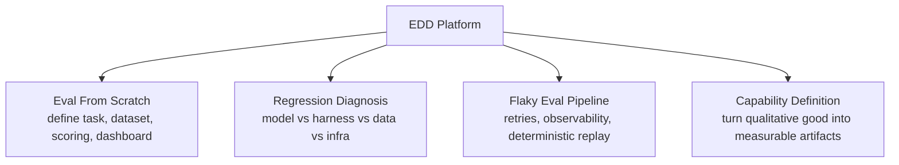

# Architecture

EDD Platform is a single product repo for evaluation-driven agent development.

The product has one React console, one platform API, shared domain objects, a
LangGraph-capable runner layer, and optional Langfuse trace evidence.

Planning companions:

- [`ARCHITECTURE_READINESS_BRIEF.md`](ARCHITECTURE_READINESS_BRIEF.md) summarizes users, requirements, constraints, and the system shape.
- [`REQUIREMENTS_AND_CONSTRAINTS.md`](REQUIREMENTS_AND_CONSTRAINTS.md) defines functional and non-functional requirements.
- [`SYSTEM_TRADEOFFS.md`](SYSTEM_TRADEOFFS.md) records the main architecture tradeoffs.
- [`OPERABILITY_AND_FAILURE_MODES.md`](OPERABILITY_AND_FAILURE_MODES.md) describes expected failure behavior and recovery paths.
- [`ARCHITECTURE_DEEP_DIVES.md`](ARCHITECTURE_DEEP_DIVES.md) expands the eval pipeline, tool governance, evidence context, and readiness flows.

## System Context

## Product Shape

## Shared Backend Model

Every example project uses the same backend model. The examples are seeded
projects, not separate apps.

## Eval-Driven Workflow

## Runtime Modes

CI must pass without model-provider credentials. Live model behavior is opt-in.

## Tool Governance Boundary

Tool orchestration should use existing agent framework primitives instead of a
custom tool loop. LangChain/LangGraph should own the mechanics of model calls,
tool-call messages, tool execution, and continuing the graph until a final
response is produced.

The platform still owns governance:

- tool definitions and schemas
- tool approval status
- which tools are allowed for each agent design
- tool-call and tool-result evidence
- evals that judge tool selection and grounded use

The runner is the adapter between those responsibilities. It converts approved
platform tools into LangChain/LangGraph tools for a run, executes the graph, and
returns tool events and final responses to the platform as evidence artifacts.

## Example Projects

Each example should exercise the same platform services:

- project-scoped state
- artifacts
- artifact links
- context packs
- runner evidence
- eval results
- failure packets
- gates
- trace references

## Responsibility Boundaries

| Area | Responsibility |
|---|---|
| React console | product UI, review panels, evidence views, local activity |
| Platform API | product state, artifacts, links, context packs, judges, gates |
| Domain package | shared object vocabulary and schemas |
| Runner package | LangChain/LangGraph execution, platform-approved tools, scenarios, replay |
| Langfuse adapter | trace references and observability integration |
| Examples | seeded demo projects using the shared backend |

## Requirements Summary

The architecture is shaped by three primary users:

- AI engineers who need to prove that a candidate agent version improved;
- evaluation leads who need explicit expectations, failures, and gates;
- platform owners who need deterministic defaults, tool governance, and
  provider-cost control.

The main functional requirements are project-scoped agent designs, scenarios,
eval contracts, runs, eval results, failure packets, fix proposals, comparisons,
gate decisions, and evidence context packs.

The main non-functional requirements are deterministic local/CI execution,
traceable evidence, governed tool use, optional live-provider calls, bounded
judge cost, and reviewable promotion decisions.

## Consistency Model

The platform favors durable evidence consistency over optimistic workflow
shortcuts.

A run, eval, comparison, or gate decision should not be treated as complete
unless the corresponding platform record and supporting artifacts have been
written. External trace systems can enrich evidence, but they do not determine
the source-of-truth state.

This means a Langfuse sync failure can leave a run usable, while a failed
platform evidence write should leave the operation incomplete.

## Failure Posture

The default recovery strategy is to preserve inspectable status and continue to
support deterministic workflows.

Examples:

- live provider failures should not break mock mode;
- Langfuse sync failures should not erase normalized platform evidence;
- invalid tool schemas should keep tools out of executable allowlists;
- candidate regressions should remain visible in comparisons;
- gate decisions should link to supporting evidence rather than infer readiness
  from the latest score.

See [`OPERABILITY_AND_FAILURE_MODES.md`](OPERABILITY_AND_FAILURE_MODES.md) for
the detailed failure-mode catalog.

## Tradeoff Summary

The most important design choices are:

- use artifacts and links as the common evidence surface;
- keep eval contracts as product data instead of hardcoded branches;
- run deterministic checks before optional LLM judges;
- keep tool definitions and allowlists platform-owned;
- treat Langfuse as observability, not product state;
- keep one monorepo while preserving package boundaries;
- start synchronous for product clarity, then move long-running work to workers
  when scale requires it.

See [`SYSTEM_TRADEOFFS.md`](SYSTEM_TRADEOFFS.md) for the full tradeoff record.

## Product Signal

The architecture is meant to show that the repo is not a one-off agent demo.

It is a reusable evaluation platform where multiple eval/research workflows use
the same backend, evidence model, runner boundary, and UI patterns.
