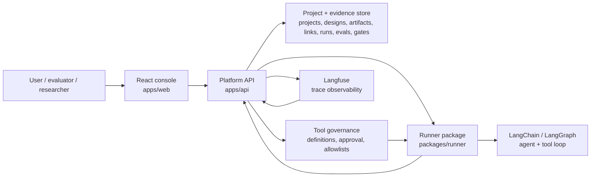
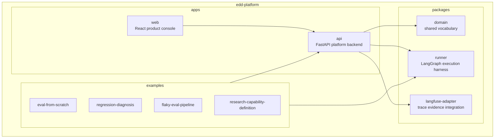
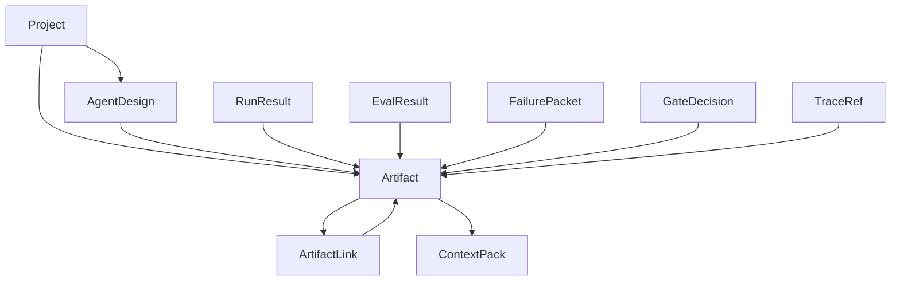
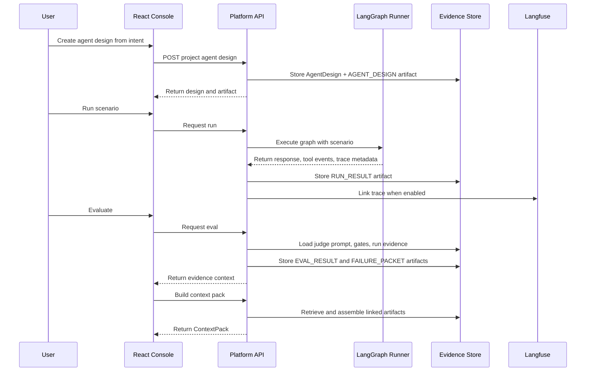
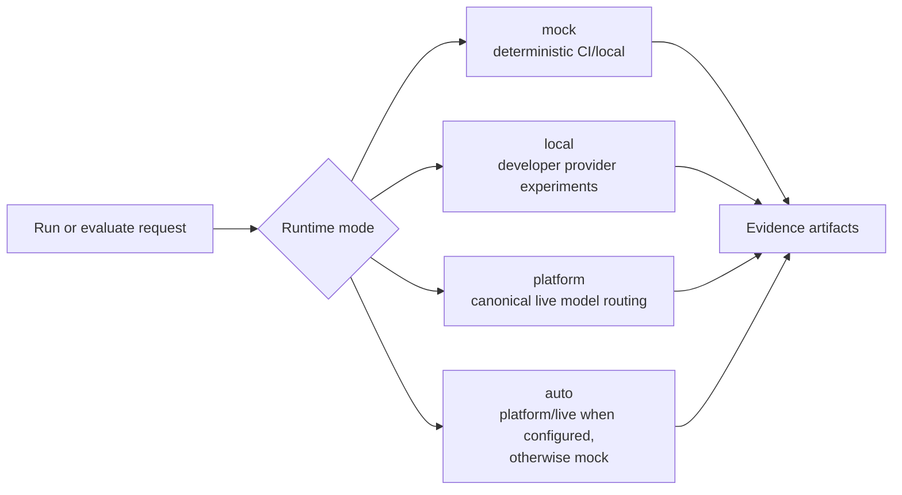
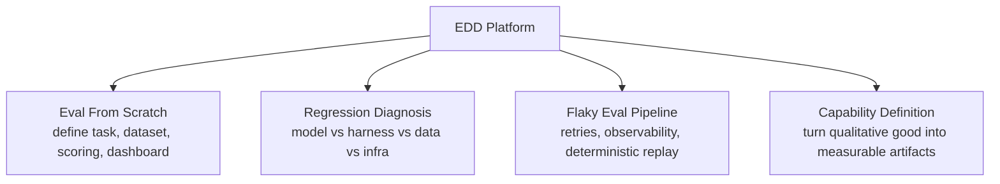

# Architecture

EDD Platform is a single product repo for evaluation-driven agent development.

The product has one React console, one platform API, shared domain objects, a
LangGraph-capable runner layer, and optional Langfuse trace evidence.

## System Context

## Product Shape

## Shared Backend Model

Every example project uses the same backend model. The examples are seeded
projects, not separate apps.

## Eval-Driven Workflow

## Runtime Modes

CI must pass without model-provider credentials. Live model behavior is opt-in.

## Tool Governance Boundary

Tool orchestration should use existing agent framework primitives instead of a
custom tool loop. LangChain/LangGraph should own the mechanics of model calls,
tool-call messages, tool execution, and continuing the graph until a final
response is produced.

The platform still owns governance:

- tool definitions and schemas
- tool approval status
- which tools are allowed for each agent design
- tool-call and tool-result evidence
- evals that judge tool selection and grounded use

The runner is the adapter between those responsibilities. It converts approved
platform tools into LangChain/LangGraph tools for a run, executes the graph, and
returns tool events and final responses to the platform as evidence artifacts.

## Example Projects

Each example should exercise the same platform services:

- project-scoped state
- artifacts
- artifact links
- context packs
- runner evidence
- eval results
- failure packets
- gates
- trace references

## Responsibility Boundaries

| Area | Responsibility |
|---|---|
| React console | product UI, review panels, evidence views, local activity |
| Platform API | product state, artifacts, links, context packs, judges, gates |
| Domain package | shared object vocabulary and schemas |
| Runner package | LangChain/LangGraph execution, platform-approved tools, scenarios, replay |
| Langfuse adapter | trace references and observability integration |
| Examples | seeded portfolio/demo projects using the shared backend |

## Portfolio Signal

The architecture is meant to show that the repo is not a one-off agent demo.

It is a reusable evaluation platform where multiple eval/research workflows use
the same backend, evidence model, runner boundary, and UI patterns.
