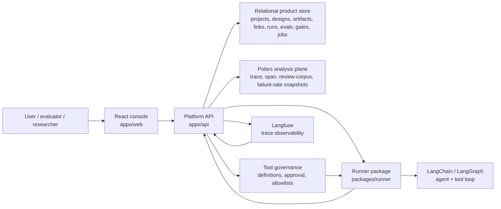
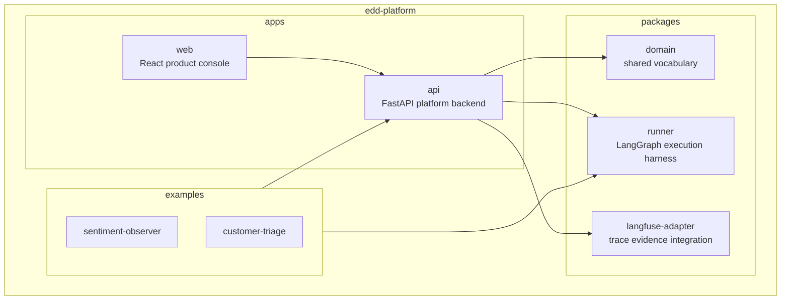
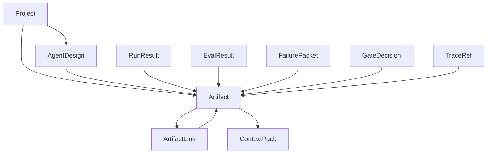
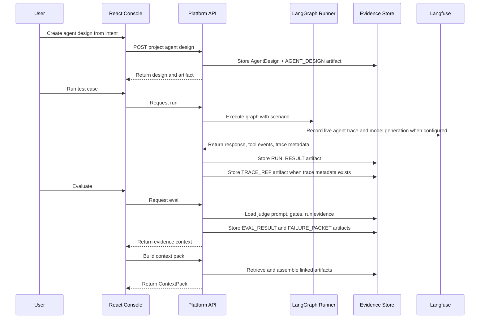
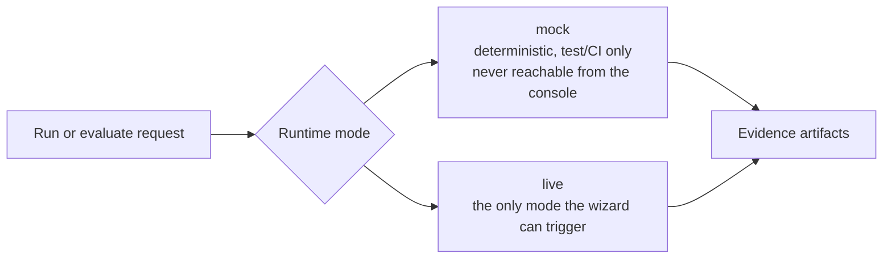
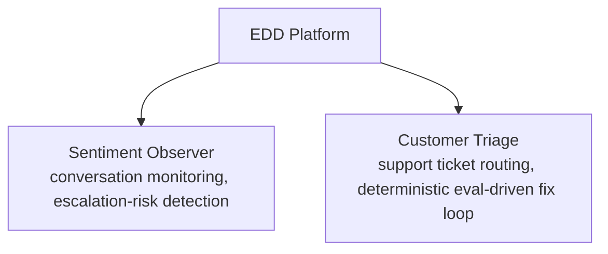

# Architecture

EDD Platform is a single product repo for evaluation-driven agent development.
The product has one React console, one platform API, shared domain objects, a
LangGraph-capable runner layer, and optional Langfuse trace evidence.

Companion doc: [`SYSTEM_TRADEOFFS.md`](SYSTEM_TRADEOFFS.md) records the
reasoning behind the design choices summarized here. See also
[`hld/`](hld) for the design history of individual capabilities and
[`hld/HLD-005-relational-metadata-and-polars-analysis-plane.md`](hld/HLD-005-relational-metadata-and-polars-analysis-plane.md)
for the Postgres source-of-truth plus Polars analysis read-side.

## Product Idea

> Help teams design, run, evaluate, fix, compare, and promote AI agents using
> durable evidence.

The platform is not a generic chat UI, a trace browser, or a local demo
workbench. It is an evidence system for improving agent behavior.

## Users and Success Criteria

| User | Needs |
|---|---|
| AI engineer | Repeatable scenarios, explicit expectations, run and tool evidence, failure diagnosis, version comparison. |
| Evaluation lead | Reusable eval contracts, judge outputs and deterministic checks, linked failure packets, gate decisions with supporting evidence, cost/trace visibility. |
| Platform owner | Approved tool definitions, agent-level tool allowlists, deterministic local/CI behavior, optional live provider execution, clear separation between product state and observability systems. |

The platform succeeds when a team can: define what good agent behavior means,
run a baseline version against a scenario, evaluate it against explicit
expectations, turn failures into actionable evidence, propose a bounded fix,
run and compare a candidate version, and make a promotion decision from
linked evidence. The key outcome is a reviewable improvement loop, not a
single good answer.

## System Context



## Product Shape



## Shared Backend Model

Every example project uses the same backend model. The examples are seeded
projects, not separate apps.



## Eval-Driven Workflow



## Runtime Modes



CI must pass without model-provider credentials, using `mock` mode. The
console hardcodes `live` mode for every run it triggers (see
`apps/web/src/main.tsx`'s `runMode` constant) — there is no user-facing
mock/live toggle. The API endpoint itself still accepts `mode` as a request
field (tests rely on this to exercise `mock` runs end-to-end), so this
boundary is enforced by the console, not by the API.

## Tool Governance Boundary

Tool orchestration uses existing agent framework primitives instead of a
custom tool loop. LangChain/LangGraph owns the mechanics of model calls,
tool-call messages, tool execution, and continuing the graph until a final
response is produced.

The platform owns governance:

- tool definitions and schemas
- tool approval status
- which tools are allowed for each agent design
- tool-call and tool-result evidence
- evals that judge tool selection and grounded use

The runner is the adapter between those responsibilities. It converts approved
platform tools into LangChain/LangGraph tools for a run, executes the graph,
and returns tool events and final responses to the platform as evidence
artifacts.

Draft tools and disabled tools are not executable. An agent can only use
tools approved by the platform and allowed for that agent. Invalid schemas
keep a tool in draft state; unapproved tool calls are blocked and can become
failure evidence.

## Component Deep Dives

### Eval Evidence Pipeline

An agent can produce a plausible answer once without becoming a reliable
candidate for promotion. The platform preserves the path from expected
behavior to observed behavior to diagnosis to fix to comparison:

```text
Scenario -> Run -> ToolCall/ToolResult artifacts -> EvalContract -> EvalResult
  -> JudgeOutput -> FailurePacket -> FixProposal -> Candidate AgentVersion
  -> Candidate Run -> Candidate EvalResult -> Comparison -> GateDecision
```

Key invariants: a run references the agent version and scenario it executed;
an eval result references the run and eval contract used; failed checks
identify observed and expected behavior; failure packets reference the
evidence that proves the failure; fix proposals link to the failure packets
they address; comparisons reference both baseline and candidate evidence.

### Evidence Context

Artifacts are useful only if users and agents can retrieve the right evidence
at the right time:

```text
Artifacts -> ArtifactLinks -> Search/filtering -> ContextPack
  -> UI review, fix proposal, comparison, gate decision
```

Context packs reference artifacts instead of replacing them, have explicit
purposes, and are rebuildable — if a context pack is incomplete, the UI shows
missing evidence rather than inventing rationale. Summaries are optional
derived evidence; when unavailable, the UI falls back to raw artifacts.

### Promotion Readiness

A passing score alone is not enough to promote an agent version. Promotion is
tied to evidence, checks, regressions, and an explicit gate decision:

```text
GateDefinition -> supporting runs/evals/comparisons -> gate review context pack
  -> GateDecision artifact
```

Gate decisions are explicit artifacts that link to supporting evidence.
Scores do not silently imply readiness, and regressions or unresolved
failures remain visible rather than being hidden by a single passing run.

## Example Projects



Each example (`examples/sentiment-observer`, `examples/customer-triage`) is a
seeded project that exercises the full product spine: agent design, versions,
scenarios, eval contracts, runs, eval results, failure packets, fix proposals,
comparisons, and evidence artifacts. Seed with
`python scripts/seed_sentiment_observer_demo.py` and
`python scripts/seed_customer_triage_demo.py` against a running local API.

## Responsibility Boundaries

| Component | Owns | Does not own |
|---|---|---|
| React console | Product UI, review panels, evidence navigation, local activity. | Durable product state. |
| Platform API | State, artifacts, links, contracts, judges, gates. | Raw framework tool-loop mechanics. |
| Runner package | LangChain/LangGraph execution, platform-approved tools, scenarios, replay. | Promotion decisions. |
| Domain package | Shared vocabulary and schema concepts. | Persistence or runtime policy. |
| Langfuse adapter | External trace references and observability sync. | Source-of-truth product records. |
| Examples | Seeded demo projects using the shared backend. | Platform services themselves. |

## Requirements

### Functional

- **Agent design**: project-scoped, captures intent and tool policy, produces
  versions so history remains reviewable.
- **Scenarios**: reusable test cases modeling single-turn, conversation, and
  trace-replay inputs; the same scenario can run against multiple versions.
- **Eval contracts**: expectations as product data — required/forbidden
  tools, required evidence, output requirements, deterministic checks,
  optional judge prompt reference.
- **Runs**: record input, output, mode, provider/model metadata, tool calls,
  tool results, and trace references when available.
- **Evaluations**: deterministic checks run before optional LLM judges; eval
  results record pass/fail, score, observed evidence, expected criteria, and
  linked artifacts.
- **Failure and fix loop**: failed checks create failure packets; fix
  proposals link to the failures they address; candidate versions come from
  fix proposals; comparisons show fixed, new, and remaining failures.
- **Gates**: gate decisions convert evidence into readiness decisions and
  must link to supporting runs, evals, comparisons, and approvals.
- **Evidence context**: search and inspect artifacts; assemble deterministic
  context packs for review, fixing, comparison, and gate decisions.

### Non-Functional

| Property | Expectation |
|---|---|
| Determinism | Local dev and CI pass without model-provider credentials via `mock` mode. |
| Traceability | Every meaningful output becomes an artifact or links to one. |
| Governance | Agents may only use platform-approved, allowlisted tools; tool calls/results are captured as evidence. |
| Cost | Live model and judge calls are opt-in; deterministic checks run first; token/cost telemetry is recorded for live calls. |
| Reliability | Provider outages, trace sync failures, and judge instability must not corrupt platform state. |
| Reviewability | Every important decision (run, check, judge output, failure packet, fix, comparison, gate) is inspectable. |
| Consistency | A run or eval should not appear complete unless its durable evidence has been written. |
| Auditability | Promotion and comparison decisions are explainable from linked artifacts, not inferred from the latest score. |
| Portability | Core records do not depend on a single external observability tool or provider. |

### Explicit Non-Goals

- Generic chatbot UI.
- General-purpose memory system.
- Langfuse trace browser.
- Unbounded autonomous self-improvement.
- Hidden eval logic that only exists in code.
- CI that depends on provider credentials.
- A separate product frontend outside `apps/web`.

## Consistency Model

The platform favors durable evidence consistency over optimistic workflow
shortcuts. A run, eval, comparison, or gate decision should not be treated as
complete unless the corresponding platform record and supporting artifacts
have been written. External trace systems can enrich evidence, but they do
not determine the source-of-truth state — a Langfuse sync failure can leave a
run usable, while a failed platform evidence write should leave the operation
incomplete.

## Operability and Failure Modes

Platform artifacts are the source of truth. Optional integrations degrade
gracefully. Failed or partial work leaves a reviewable status. Live provider
behavior is never required for local or CI confidence, and promotion
decisions are explicit and evidence-backed.

| Failure | Risk | Expected behavior |
|---|---|---|
| Live provider unavailable | A live run or judge cannot complete. | Mark it failed, preserve input/mode/provider metadata and error summary, don't infer success from missing output; `mock` mode keeps working. |
| Langfuse sync fails | Trace creation, score sync, or comment mirroring fails. | Preserve normalized run/eval artifacts, record sync status clearly, don't block the core evidence loop. |
| Tool schema invalid | A tool can't be safely adapted into runner primitives. | Keep the tool in draft/invalid state, block it from execution, surface validation errors near the definition. |
| Agent calls unapproved tool | A tool call falls outside the agent's allowlist. | Block execution, record the attempted call as evidence, fail relevant checks, support a failure packet. |
| Run succeeds but evidence write fails | The runner returns output but the API can't persist it. | Treat the operation as incomplete; never report a complete run without durable evidence. |
| Judge output inconsistent | A judge returns malformed output or contradicts deterministic checks. | Prefer deterministic results, store the malformed output as failed judge evidence, avoid silent score changes. |
| Candidate fix regresses | A fix resolves one failure but breaks another requirement. | Comparison shows fixed/new/remaining failures; the candidate never silently replaces baseline behavior. |
| Stale context pack | A pack was assembled before new artifacts/links existed. | Context packs are rebuildable from current artifacts; summaries cache only when revisions haven't changed. |
| Cost spike from live evaluation | Repeated live runs/judges/summaries create unexpected cost. | Live behavior stays opt-in; token/cost telemetry is stored; deterministic checks run first. |
| Partial comparison inputs | Baseline or candidate runs exist without eval results. | Comparison reports missing inputs instead of inferring improvement; the UI guides the user to complete the missing side. |

Reliability priorities, in order: durable project-scoped records, deterministic
local/CI paths, optional live integrations, explicit evidence links, and
reviewable promotion decisions.

## Tradeoff Summary

The most important design choices are: use artifacts and links as the common
evidence surface; keep eval contracts as product data instead of hardcoded
branches; run deterministic checks before optional LLM judges; keep tool
definitions and allowlists platform-owned; treat Langfuse as observability,
not product state; keep one monorepo while preserving package boundaries;
start synchronous for product clarity, then move long-running work to
workers when scale requires it.

See [`SYSTEM_TRADEOFFS.md`](SYSTEM_TRADEOFFS.md) for the full reasoning
behind each choice.

## Open Scale Path

The current design is intentionally product-first and deterministic. As
usage grows, the clean extension points are: move long-running runs and
evals to background workers; introduce queue-backed execution with
idempotent run records; add database indexes for project, artifact type,
run, and version queries; add object storage for large trace/artifact
payloads; cache context packs and summaries by artifact revision; enforce
tenant isolation and role-based permissions; introduce stricter OpenAPI
linting and generated clients.

## Product Signal

The architecture is meant to show that the repo is not a one-off agent demo.
It is a reusable evaluation platform where multiple eval/research workflows
use the same backend, evidence model, runner boundary, and UI patterns.
